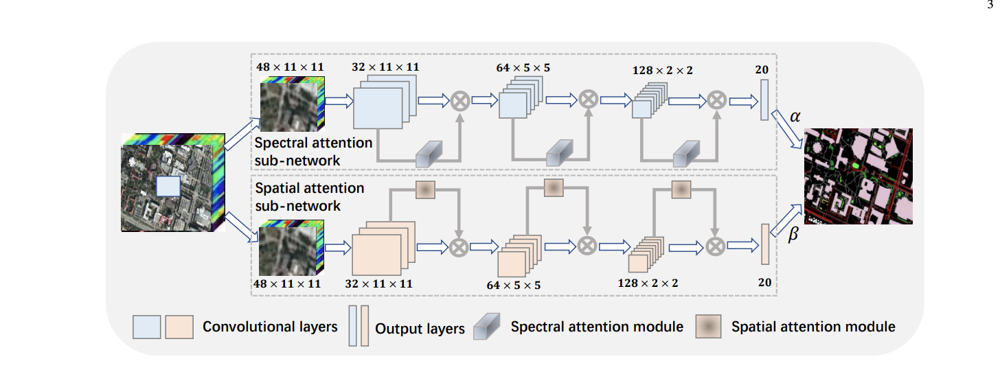

# DeepTreeAttention
[](https://travis-ci.org/weecology/DeepTreeAttention)

Implementation of Hang et al. 2020 [Hyperspectral Image Classification with Attention Aided CNNs](https://arxiv.org/abs/2005.11977) for tree species prediction.

# Model Architecture




# Organization

```
├── conf                   # Config files for model training and evaluation
├── data                   #  Location to place data for model reading. Most data is too large to be in version control, see below
├── DeepTreeAttention                   # Source files
├── experiments                    # Model training and SLURM multi-gpu cluster experiments with comet dashboards 
├── models                    # Trained snapshots
├── docs                   #
├── tests                    # Automated pytest tests
├── www                   # repo images
├── LICENSE
└── README.md
└── environment.yml # Conda Environment for model training and tests
```

# Roadmap

## NEON

- [x] Data pipeline to predict species class for a DeepForest bounding box (https://deepforest.readthedocs.io/) for NEON Woody Veg Data
- [x] Data pipeline to predict species class for a bounding box with weakly learned labels from random forest
- [x] Training Pipeline for Hyperspectral DeepTreeAttention Model
- [x] Add site metadata
- [ ] Training Pipeline for RGB DeepTreeAttention Model (technically works but is ineffective)
- [x] Learned fusion among data inputs

# How to view the experiments

This repo is being tested as an open source project on comet_ml. Comet is a great machine learning dashboard. The project link is [here](https://www.comet.ml/bw4sz/neontrees/view/wL0xwid3h619hL3JfxAGwnBxb).
Major milestones will be listed below, but for fine-grained information on code, model structure and evaluation statistics, see individual comet pages. To recreate experiments, make sure to set your own comet_ml api key by creating a .comet.config in your home directory (see https://www.comet.ml/docs/python-sdk/advanced/
).

* [Hyperspectral only](https://www.comet.ml/bw4sz/neontrees/a8595bf716024e77ab3b27f9adfb1122?experiment-tab=images&viewId=GbA6bYzK40jdEhI98c0KnPPUC)

### Config file

See conf/tree_config.yml for training parameters.

### Data

The field data are from NEON's woody vegetation structure dataset. A curated .shp is found at data/processed/field.shp which contains species labels and utm coordinates of each tree stem

### Workflow

To generate training data from existing shapefiles of deepforest predictions

```
python experiments/Trees/generate_.py
```

To generate new deepforest boxes, you will need to create a seperate conda environment. DeepForest requires tensorflow <2.0 where this repo is >2.0. The requirements are otherwise the same. To generate boxes see

```
python experiments/Trees/prepare_field_data.py
```

After creating training data the main entry point is 

```
python experiments/Trees/run.py
```

# Citation

The original network can be cited:

* Hang, Renlong, Zhu Li, Qingshan Liu, Pedram Ghamisi, and Shuvra S. Bhattacharyya. 2020. “Hyperspectral Image Classification with Attention Aided CNNs,” May. http://arxiv.org/abs/2005.11977.
 
This repo can be cited on Zenodo once a release is created. 
